# Blockworks API Documentation

A modern documentation site for Blockworks API metrics, built with [Mintlify](https://mintlify.com) and automated metric synchronization.

# Quick Start

### Prerequisites

- [Bun](https://bun.sh) runtime.  _(see [explanation](#why-bun) for details)_

### Installation

```bash
# Clone the repository
git clone git@github.com:Blockworks-Projects/api-docs.git
cd api-docs

# Install dependencies
bun install
```

### Development

```bash
# Start the development server
bun dev
```

The documentation site will be available at `http://localhost:3333`.

### Sync Metrics

```bash
# Synchronize metrics from API
bun sync
```

# Available Commands

### `bun dev`
Starts the Mintlify development server on port 3333 (to avoid conflicting with other services on 3000). This provides live reloading and preview of documentation changes.

### `bun sync`
Executes the complete metric synchronization process:

- **Fetches** all metrics from the Blockworks API
- **Filters** out metrics with incomplete descriptions
- **Generates** individual metric documentation pages
- **Creates** a comprehensive metrics catalog
- **Updates** navigation structure in `docs.json`
- **Synchronizes** OpenAPI specification with standardized examples
- **Links** USD and native currency metric pairs
- **Reports** any API errors or omitted metrics

## Sync Process Flow

```mermaid
flowchart LR
    B(🔎 Fetch All Metrics from API)
    B --> C(🚫 Omit zero-value metrics)
    C --> D(✏️ Generate Metric Pages)
    C --> E(📖 Generate Metrics Catalog)
    C --> F(📋 Update Navigation Structure)
    C --> G(🔧 Update OpenAPI Specification)
        

    D --> D1(📝 Create MDX files with frontmatter)
    D --> D2(🔗 Add USD/native cross-references)
    D --> D3(📄 Fetch live sample data)
    E --> E1(🏷️ Group by category & identifier)
    E --> E2(🔗 Link chain names to pages)
    F --> F1(📁 Organize by project/category)
    F --> F2(🔤 Sort alphabetically)
    G --> G1(➕ Add missing endpoints)
    G --> G2(🔄 Update with placeholder examples)

    style B fill:#f3e5f5
    style C fill:#ffeeee
    style D fill:#eef5ff
    style D1 fill:#eef5ff
    style D2 fill:#eef5ff
    style D3 fill:#eef5ff
    style E fill:#fff8e1
    style E1 fill:#fff8e1
    style E2 fill:#fff8e1
    style F fill:#f1f8e9
    style F1 fill:#f1f8e9
    style F2 fill:#f1f8e9
    style G fill:#ffeedd
    style G1 fill:#ffeedd
    style G2 fill:#ffeedd
```




<br /><br />

# Why [Bun](https://bun.sh)?

- **Native TypeScript Support**: No additional transpilation setup required
- **Built-in Package Manager**: Fast dependency installation and management
- **Single Runtime**: Eliminates the need for separate Node.js and npm/yarn setup
- **Performance**: Significantly faster execution compared to Node.js
- **Simplicity**: Everything needed is included out of the box
