# Blockworks API Documentation

Blockworks API documentation site, built with [Mintlify](https://mintlify.com), using automated metric synchronization.

# Quick Start

### 0. Prerequisites

- [Bun](https://bun.sh) runtime.  _(see [explanation](#why-bun) for details)_

### 1. Installation

```bash
# Clone the repository
git clone git@github.com:Blockworks-Projects/api-docs.git
cd api-docs

# Install dependencies
bun install
```

### 2. Create `.env.local`

Follow the [guide](https://docs.blockworksresearch.com/getting-started#complete-walkthrough) to get a valid API key.

```bash
# .env.local
BWR_API_KEY="valid-research-api-key"
```

# Available Commands

### `bun dev`
Starts the Mintlify development server on port [3333](http://localhost:3333) (to avoid conflicting with other services on 3000). This provides live reloading and preview of documentation changes.

### `bun sync`
Executes the complete metric synchronization process:

- **Fetches** all metrics from the Blockworks API
- **Filters** out metrics with incomplete descriptions
- **Generates** individual metric documentation pages
- **Creates** a comprehensive metrics catalog
- **Updates** OpenAPI specification with standardized examples
- **Generates** asset expansion option pages with live examples
- **Updates** navigation structure in `docs.json`
- **Links** USD and native currency metric pairs
- **Reports** any API errors or omitted metrics

### `bun only:code`
Stages only code changes (excludes generated files) and automatically stashes remaining unstaged files for clean commits.

### `bun only:generated`
Stages only generated files from sync command output for separate commit tracking.

## Sync Process Flow

```mermaid
flowchart TD
    A[📂 Catalog Existing Metrics] --> B[🔎 Fetch All Metrics from API]
    B --> C[🚫 Filter Bad Descriptions]
    C --> D[📊 Compare & Calculate Changes]
    D --> E[🧹 Clean Existing Content]
    E --> F[✏️ Generate Metric Pages]
    F --> G[📖 Generate Metrics Catalog]
    G --> H[🔧 Update OpenAPI Specification]
    H --> I[🎯 Update Asset Expansion Options]
    I --> J[📋 Update Navigation Structure]
    J --> K[📊 Display Summary & Changelog]
    
    A --> A1[📁 Scan MDX files recursively]
    A --> A2[🔍 Extract project/identifier pairs]
    C --> C1[🚫 Omit There is/are no... patterns]
    D --> D1[➕ Identify added metrics]
    D --> D2[➖ Identify removed metrics]
    F --> F1[📝 Create MDX files with frontmatter]
    F --> F2[🔗 Add USD/native cross-references]
    F --> F3[📄 Fetch live sample data]
    G --> G1[🏷️ Group by category & identifier]
    G --> G2[🔗 Link chain names to pages]
    H --> H1[➕ Add missing endpoints]
    H --> H2[🔄 Update with placeholder examples]
    I --> I1[📝 Extract expand enum from OpenAPI]
    I --> I2[📄 Generate pages with live API examples]
    J --> J1[📁 Organize by project/category]
    J --> J2[🔤 Sort alphabetically]
    J --> J3[📂 Add Assets Expand Options dropdown]
    
    style A fill:#e8f4f8
    style A1 fill:#e8f4f8
    style A2 fill:#e8f4f8
    style B fill:#f3e5f5
    style C fill:#ffeeee
    style C1 fill:#ffeeee
    style D fill:#fff0f5
    style D1 fill:#fff0f5
    style D2 fill:#fff0f5
    style E fill:#fff3e0
    style F fill:#eef5ff
    style F1 fill:#eef5ff
    style F2 fill:#eef5ff
    style F3 fill:#eef5ff
    style G fill:#fff8e1
    style G1 fill:#fff8e1
    style G2 fill:#fff8e1
    style H fill:#f1f8e9
    style H1 fill:#f1f8e9
    style H2 fill:#f1f8e9
    style I fill:#ffeedd
    style I1 fill:#ffeedd
    style I2 fill:#ffeedd
    style J fill:#e8f5e8
    style J1 fill:#e8f5e8
    style J2 fill:#e8f5e8
    style J3 fill:#e8f5e8
    style K fill:#fce4ec
```




<br /><br />

# GitHub Actions

### Sync Metrics Documentation
Automated workflow that runs twice weekly (Tuesday/Thursday at 9:00 AM UTC) to sync metrics documentation with the latest API changes and create pull requests with updates.

# Why [Bun](https://bun.sh)?

- **Native TypeScript Support**: No additional transpilation setup required
- **Built-in Package Manager**: Fast dependency installation and management
- **Single Runtime**: Eliminates the need for separate Node.js and npm/yarn setup
- **Performance**: Significantly faster execution compared to Node.js
- **Simplicity**: Everything needed is included out of the box
